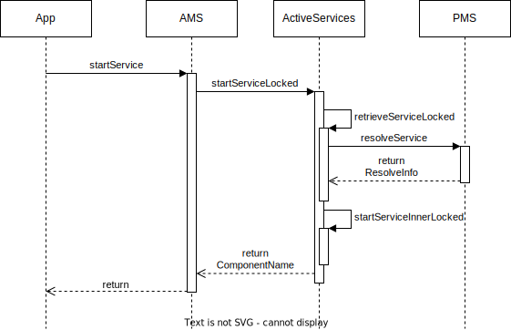
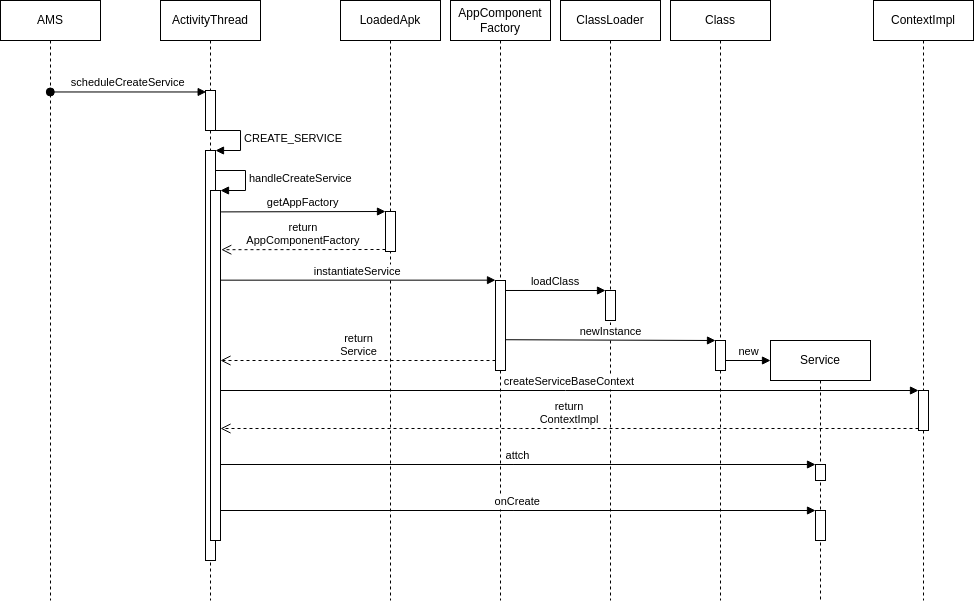

# Android系统中的Service组件初始化过程

## 系统侧检索Service组件过程

系统中启动service组件通过ActiveServices服务来启动，通过PMS的resolveService检索对应的组件，再调度启动对应的组件。所以任何一个Service组件如果需要能够启动，需要再PMS的resolveService能够检索到，否则将无法启动。

## 应用侧响应Service创建过程

服务侧检索Service组件的过程略，Android中的Service组件在应用侧的初始化过程如下图所示：

系统中AMS检索到要启动的组件后，通过给应用进程的ActivityThread发送一个schedulCreateService的IPC调用，在ActivityThread中处理为CREATE_SERVICE消息，最终通过AppComponentFactory调用classLoader加载类后，创建出对应的Service类对象。将Service组件和对应的Context上下文进行绑定，然后触发onCreate回调。

## 隐式的为应用添加Service组件

在Android开发中，如果要添加组件，需要在系统的AndroidManifest清单中由应用开发者显示的声明一个Service组件，这样在应用安装的时候PMS才能扫描出对应的组件，并在PMS中注册

隐式的为应用添加组件，希望能达到的目的是，应用在没有显式的声明组件的情况下，系统为其自动生成一个Service组件，让其可以被调用起来。

