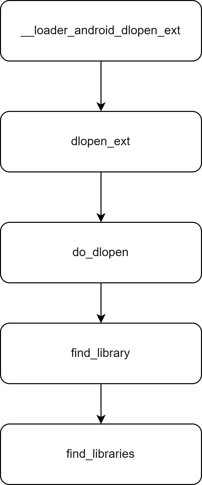

# Android中加载so机制和namespace


## Android中加载so的流程


android中可以通过System的loadLibrary的接口调用，loadLibrary通过虚拟机的JNI调用然后执行到linker中


## namespace

### nativeLoader中的namespace管理

在中native_loader.cpp，namespace通过g_namespaces来管理：

```C++
LibraryNamespaces* g_namespaces = new LibraryNamespaces;
```

在虚拟机启动阶段,native_loader会调用IntializeNativeLoader来对namespace来进行初始化：

```C++
void InitializeNativeLoader() {
#if defined(ART_TARGET_ANDROID)
  std::lock_guard<std::mutex> guard(g_namespaces_mutex);
  g_namespaces->Initialize();
#endif
}
```

### 系统默认的namespace

g_namespaces的Intialize中会将所有系统中公开的的libraries通过OpenSystemLibrary加载：

```C++
oid LibraryNamespaces::Initialize() {
  // Once public namespace is initialized there is no
  // point in running this code - it will have no effect
  // on the current list of public libraries.
  if (initialized_) {
    return;
  }

  // Load the preloadable public libraries. Since libnativeloader is in the
  // com_android_art namespace, use OpenSystemLibrary rather than dlopen to
  // ensure the libraries are loaded in the system namespace.
  //
  // TODO(dimitry): this is a bit misleading since we do not know
  // if the vendor public library is going to be opened from /vendor/lib
  // we might as well end up loading them from /system/lib or /product/lib
  // For now we rely on CTS test to catch things like this but
  // it should probably be addressed in the future.
  for (const std::string& soname : android::base::Split(preloadable_public_libraries(), ":")) {
    void* handle = OpenSystemLibrary(soname.c_str(), RTLD_NOW | RTLD_NODELETE);
    LOG_ALWAYS_FATAL_IF(handle == nullptr,
                        "Error preloading public library %s: %s", soname.c_str(), dlerror());
  }
}
```

公共的so通过preloadable_public_libraries函数加载列表。其中主要包括：

1. 在/system/etc/public.libraries.txt中的so列表
2. 在/linkerconfig/apex.libraries.config.txt中的so列表

通过OpenSystemLibrary打开的应用，对应的namespace为**“system”**或“**default**”：

```C++
void* OpenSystemLibrary(const char* path, int flags) {
#ifdef ART_TARGET_ANDROID
  // The system namespace is called "default" for binaries in /system and
  // "system" for those in the Runtime APEX. Try "system" first since
  // "default" always exists.
  // TODO(b/185587109): Get rid of this error prone logic.
  android_namespace_t* system_ns = android_get_exported_namespace("system");
  if (system_ns == nullptr) {
    system_ns = android_get_exported_namespace("default");
    LOG_ALWAYS_FATAL_IF(system_ns == nullptr,
                        "Failed to get system namespace for loading %s", path);
  }
  const android_dlextinfo dlextinfo = {
      .flags = ANDROID_DLEXT_USE_NAMESPACE,
      .library_namespace = system_ns,
  };
  return android_dlopen_ext(path, flags, &dlextinfo);
#else
  return dlopen(path, flags);
#endif
}
```

然后调用android_dlopen_ext（linker）在对应的namespaces中load so。

### 应用的namespace

```C++
  std::lock_guard<std::mutex> guard(g_namespaces_mutex);
  NativeLoaderNamespace* ns;

  if ((ns = g_namespaces->FindNamespaceByClassLoader(env, class_loader)) == nullptr) {
    // This is the case where the classloader was not created by ApplicationLoaders
    // In this case we create an isolated not-shared namespace for it.
    Result<NativeLoaderNamespace*> isolated_ns =
        CreateClassLoaderNamespaceLocked(env,
                                         target_sdk_version,
                                         class_loader,
                                         /*is_shared=*/false,
                                         /*dex_path=*/nullptr,
                                         library_path,
                                         /*permitted_path=*/nullptr,
                                         /*uses_library_list=*/nullptr);
    if (!isolated_ns.ok()) {
      *error_msg = strdup(isolated_ns.error().message().c_str());
      return nullptr;
    } else {
      ns = *isolated_ns;
    }
  }

  return OpenNativeLibraryInNamespace(ns, path, needs_native_bridge, error_msg);
```

​	应用在加载so时，需要首先明确应用的namesapce，首先去g_namespaces全局的namespace管理器中查找当前的class_loader有没有对应的namespace，可以看到是按照调用loadLibrary所在的class的classLoader来查找的，一般来说应用首次启动时，对应的classloader是不存在对应的namespace的，此时将会通过**CreateClassLoaderNamespaceLocked**创建该classLoader的namespace。

```C++
// classloader-namespace is a linker namespace that is created for the loaded
// app. To be specific, it is created for the app classloader. When
// System.load() is called from a Java class that is loaded from the
// classloader, the classloader-namespace namespace associated with that
// classloader is selected for dlopen. The namespace is configured so that its
// search path is set to the app-local JNI directory and it is linked to the
// system namespace with the names of libs listed in the public.libraries.txt.
// This way an app can only load its own JNI libraries along with the public libs.
constexpr const char* kClassloaderNamespaceName = "classloader-namespace";
```

CreateClassLoaderNamespaceLocked创建出一个名字为“classloader-namespace”的命名空间，从以上注释中说明的很清楚，classloader-namespace是linker中的namespace，专门用于app的classloader，这个命名空间中会配置了关于这个app的本地jni的搜索路径。这个namespace会链接到前面所述的system的命名空间，从而可以加载在public.libraries.txt白名单中的so。


## linker中的搜索so过程

上层调用loadLibrary后，最终会执行到linker的dlopen_ext中：

```C++
void* __loader_android_dlopen_ext(const char* filename,
                           int flags,
                           const android_dlextinfo* extinfo,
                           const void* caller_addr) {
  return dlopen_ext(filename, flags, extinfo, caller_addr);
}
```

android_dlextinfo中包含了加载so的namespace信息：

```C++
/** Used to pass Android-specific arguments to `android_dlopen_ext`. */
typedef struct {
  /** A bitmask of `ANDROID_DLEXT_` enum values. */
  uint64_t flags;

  /** Used by `ANDROID_DLEXT_RESERVED_ADDRESS` and `ANDROID_DLEXT_RESERVED_ADDRESS_HINT`. */
  void*   reserved_addr;
  /** Used by `ANDROID_DLEXT_RESERVED_ADDRESS` and `ANDROID_DLEXT_RESERVED_ADDRESS_HINT`. */
  size_t  reserved_size;

  /** Used by `ANDROID_DLEXT_WRITE_RELRO` and `ANDROID_DLEXT_USE_RELRO`. */
  int     relro_fd;

  /** Used by `ANDROID_DLEXT_USE_LIBRARY_FD`. */
  int     library_fd;
  /** Used by `ANDROID_DLEXT_USE_LIBRARY_FD_OFFSET` */
  off64_t library_fd_offset;

  /** Used by `ANDROID_DLEXT_USE_NAMESPACE`. */
  struct android_namespace_t* library_namespace;
} android_dlextinfo;
```

linker中搜索so的调用过程如下所示：



## linker中的namespace配置


