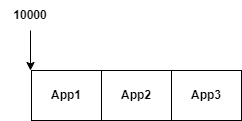
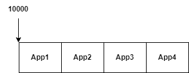
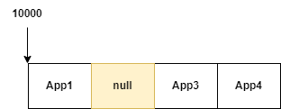
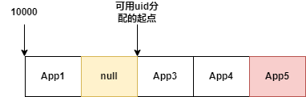
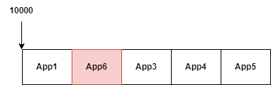
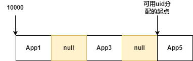
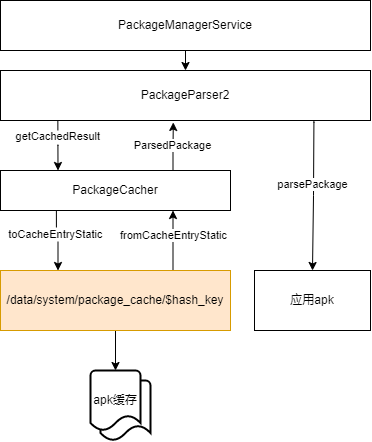
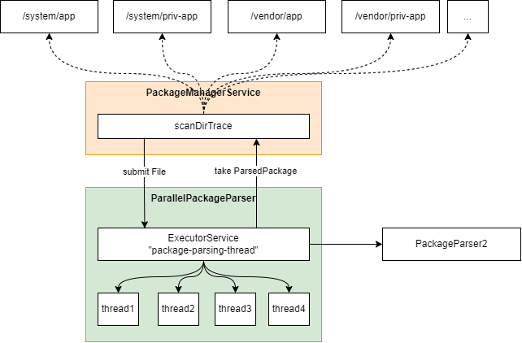

# Android中的PMS服务

PMS是Android中的核心服务，负责管理系统中的所有应用，包括应用的组件，系统中如果启动应用，需要通过PMS来查询其所管理的所有应用的信息。PMS的主要功能包括以下：
- 应用安装
- 应用卸载
- 应用的数据管理
- 应用的组件管理

## PMS在系统中的层级
## PMS的启动
## PMS中预装应用的扫描过程
## PMS中安装应用的过程
## PMS中应用的数据沙盒隔离
## 应用APK组成方式
## APEX应用
## 应用的UID
系统中安装的应用，每个应用都具有一个唯一的UID，uid由PMS分配，应用的uid用户数据沙盒目录的隔离等，进程的权限等场景。是系统中非常重要的信息。在PMS中的每个应用的uid为整数，PMS将uid分为几个号段，应用从对应的号段中分配。在Process.java中：
```java
    /**
     * Defines the start of a range of UIDs (and GIDs), going from this
     * number to {@link #LAST_APPLICATION_UID} that are reserved for assigning
     * to applications.
     */
    public static final int FIRST_APPLICATION_UID = 10000;

    /**
     * Last of application-specific UIDs starting at
     * {@link #FIRST_APPLICATION_UID}.
     */
    public static final int LAST_APPLICATION_UID = 19999;
```
为每个应用分配id从10000到19999，总共10000个id，所以理论上系统中最多能安装的应用上限为10000个。除了以上uid，在系统中还会保留一些特定uid给特殊的应用，这些uid都是小于10000的id，都在Process.java中进行定义：
|UID|值|用途|
|-|-|-|
|ROOT_UID|0|root进程的uid|
|SYSTEM_UID|1000|system进程，一般system_server进程的uid，和sharedUid为andorid.system.uid的进程|
|PHONE_UID|1001|phone进程，通话相关的进程|
|SHELL_UID|2000|shell进程|
|LOG_UID|1007|在log group群组中的进程|
|WIFI_UID|1010|wifi相关的进程|
|MEDIA_UID|1013|mediaserver相关的进程|
|DRM_UID|1019|DRM相关的进程|
|SDCARD_RW_GID|1015|用于控制是否可以写存储区的groupid|
|VPN_UID|1016|vpn的uid|
|KEYSTORE_UID|1017|keystore的uid|
|CREDSTORE_UID|1076|credstore的uid|
|...|...|...|

以上定义的uid，部分可能直接用与native进程的uid，部分可用于给应用apk进行分配，还有部分用于group id定义。本节主要关注应用的uid，其他细节暂不描述。

### UID的分配算法
默认情况下，当系统安装应用时，应用的uid从10000开始往后依次分配，所以先安装的应用具有较小的uid，后安装的应用有较大的uid。但是由于应用可能会发生卸载的情况，所以可能部分uid会被空闲出来。
Uid的分配示意图如下所示：
假设一开始系统安装了3个应用，那么他们的uid依次从10000开始往后分配：



如果这时再安装一个新应用App4，那么将依次往后找未被占用的uid来进行分配：



如果这时将应用2卸载，那么uid的分配占用情况将变成：



原来app2占用的uid将会被释放，在系统内部注册表中，对应的位置会填充一个null指针，如果要搜索uid时，对应的的位置为null的uid可以被分配，但是此时有个特殊的处理。如果再安装应用App5时，并不是直接使用App2的uid。而是在后面尾部分配：


为什么不能直接使用App2的uid，原因可能是系统中可能还有内存的数据可能通过App2的uid来管控，如果直接复用App2的uid给其他的应用，可能会导致新安装的应用具有App2的权限出现安全问题。卸载应用的uid只能在系统重启后可以继续使用。系统中通过设置一个可用的uid的分配起点来避免刚卸载的应用的uid被复用。如果任何一个应用被卸载，那么可用的的uid分配起点只能从该uid的后面开始。如果没有空闲的，那么在最尾部追加。假设重启后再安装App6，那么uid的分配状态可能如下：



如果用户批量卸载了大量的应用，那么可用的的uid分配起点的状态将如下所示：



可用uid的分配起点总是指向被卸载的应用中的最大的uid的后一个uid。


## 应用扫描信息的缓存处理
在系统中会有大量的应用安装，Android系统开机后，需要将所有的应用进行扫描，如果每次都重新进行扫描，那么系统的启动将会非常的慢，因此Android设计了缓存的机制。  
系统在扫描应用的时候，将会把应用的信息缓存起来，下次系统启动的时候，将直接从缓存中读取信息，不再需要解压apk，解析AndroidManifest中的应用的组件信息。

### 缓存目录位置
在系统的/data/system/package_cache目录下保存系统的应用信息的缓存。系统会根据当前系统的版本指纹信息通过SHA1算法生成一个hash值，将该hash创建目录，所有的应用的信息的缓存保存在对应目录下。/data/system/package_cache目录只会有一个子目录，如果当前系统升级，如OTA版本升级，那么hash将会发生变化，原版本下的所有缓存将被清理掉，新版本缓存重新生成。  
在缓存目录下每个apk的应用信息对应一个缓存文件，缓存文件以应用名+扫描时应用的flag作为key保存。

### 缓存在PMS中的上下文



整体结构如上图所示，在PMS中如果需要扫描应用，将通过PackageParser2来扫描，扫描时首先通过PackageCacher来查询缓存目录中是否有对应应用的缓存信息如果，有缓存则将直接从缓存中恢复出ParsedPackage，即应用的解析信息，不在需要重新扫描apk。反之，如果对应的目录下没有缓存，那么将解析apk，并从apk的AndroidManifest中解析出应用信息，最后在通过缓存保存接口将应用信息保存，下次开机可以直接使用缓存而无再次扫描。

### 应用的缓存内容
应用缓存的内容很简单，即是将ParsedPackage序列化为二进制流后直接写入到文件中。因为系统中的ParsedPackage对象实现了了Parcelable解耦，直接通过Parcel的相关接口序列化和反序列化。读取缓存也很简单，直接由ParsedPackage从二进制流中反序列化出对应的对象。

## dex2oat编译

## 应用的类型

## 应用扫描的并行化
PMS扫描应用时，需要扫描所有的应用，如果使用串行的方式来扫描，那么可能会导致系统启动缓慢。系统中在扫描应用时，通过并行扫描的方式来扫描系统中的应用，扫描的过程如下所示：



对于安装在同一目录下的所有应用，PMS启动一个ParallePackageParser来进行应用的扫描。在该扫描器中，会使用一个固定大小为4的线程池来进行应用并行扫描，应用apk的文件路径提交给扫描线程池，然后从线程池中依次获取扫描的结果，在系统中即ParsedPackage对象。系统中可能在/system/app，/system/priv-app等目录下预装有应用。需要注意的是，并不是所有的目录并行扫描。而是每个目录依次扫描，在目录中的应用并行扫描。如：先并行扫描/system/app中的所有应用（4个线程同时扫描），扫描完成后在并行扫描/system/priv-app中的所有应用，依次类推直到所有的应用扫描完成。  
当然，由于ParallelPackageParser最终还是使用PackageParser2来解析应用，由于之前分析的缓存的设计，可能其最终可能会直接使用缓存中读取出来的结果，而无需真正解析apk。

