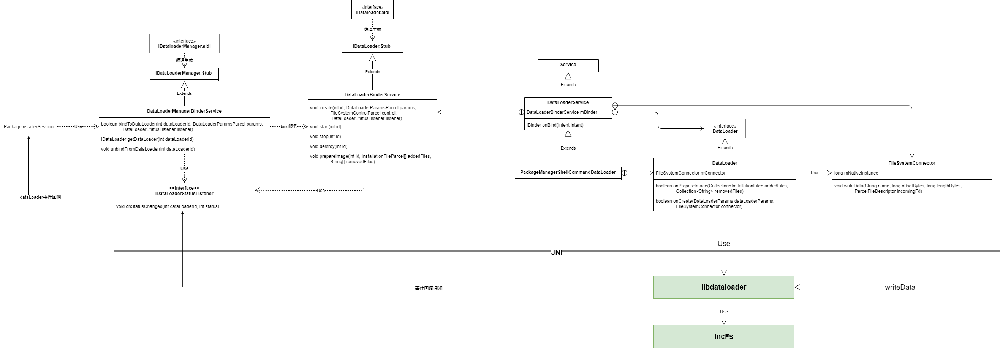

# Android中的增量安装

## 安装时使用dataloader相关的数据结构



主要结构如上图所示。

安装器安装支持两种安装方式：dataloader安装和增量安装

### dataloader安装

如果安装参数中的dataLoaderParams指定，则表明该次安装为dataloader安装：

```java
    private boolean isDataLoaderInstallation() {
        return params.dataLoaderParams != null;
    }

```

dataloader安装包括两种形式，一种为流式安装，另一种则为增量安装，通过dataloader的type来判断：

### 增量安装

## dataloader的绑定


应用安装的时候使用的dataloader如上图所示，packageInstaller

