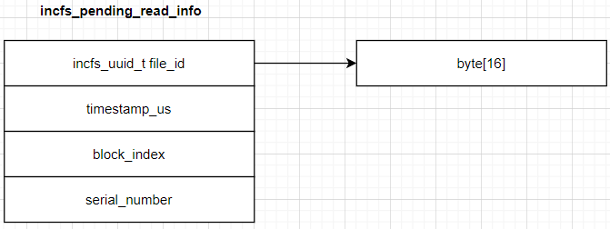
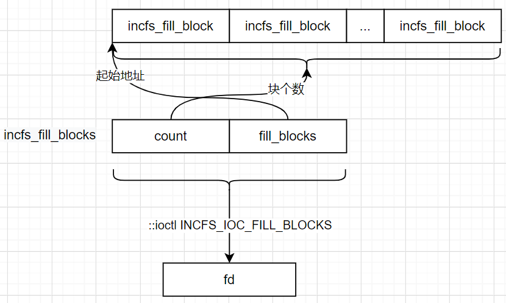

# Android增量文件系统

基于Android R版本的AOSP代码分析

## 增量文件系统的代码路径

增量文件在Android中用户空间态的代码位置在/system/core/incremental_delivery

## 系统是否支持增量文件系统

通过filesystem来判断。在/proc/filesystems中，系统会列出所有的文件系统，如果其中具有incremental-fs的文件，则证明系统支持增量文件系统

## 文件系统的feature

通过是否判断具有/sys/fs/incremental-fs目录。在/sys/fs/incremental-fs/features中保存有关于增量文件系统的feature。一般在/sys/fs/incremental-fs/features目录下具有一个corefs的文件，标明incfs为核心的文件系统。

## 增量文件系统的数据结构

### IncFsControl

```C++
struct IncFsControl final {
    IncFsFd cmd;
    IncFsFd pendingReads;
    IncFsFd logs;
    constexpr IncFsControl(IncFsFd cmd, IncFsFd pendingReads, IncFsFd logs)
          : cmd(cmd), pendingReads(pendingReads), logs(logs) {}
};
```

IncFsControl数据结构中包含

cmd：控制命令的文件句柄，root目录下的.pending_reads文件

pendingReads：root目录下的.pending_reads文件

logs：log文件的文件句柄，root目录下的.log句柄

### IncFsSpan

```C++
typedef struct {
    const char* data;
    IncFsSize size;
} IncFsSpan;
```

增量文件系统读取时使用的数据结构，包括数据指针和size大小。

### IncFsFileId

```C++
typedef struct {
    union {
        char data[16];
        int64_t for_alignment;
    };
} IncFsFileId;
```

用于表示Fs文件的id，id为16个字节的ascii码。如果所有ascii码均为-1，则表示非法的FileId

### IncFsFeature

```c++
typedef enum {

  INCFS_FEATURE_NONE = 0,

  INCFS_FEATURE_CORE = 1,

} IncFsFeatures;
```

incfs的特性，主要就是2个，core类型和none类型

### IncFsNewFileParams

文件创建时的参数。

```C++
typedef struct {
    IncFsSize size;
    IncFsSpan metadata;
    IncFsSpan signature;
} IncFsNewFileParams;
```

size指定文件的大小，metadata为对应文件的标签数据，signature为签名数据。

### IncFsDataBlock

```C++
typedef struct {

  IncFsFd fileFd;//文件句柄

  IncFsBlockIndex pageIndex;//block的下标

  IncFsCompressionKind compression; //压缩的方式

  IncFsBlockKind kind;// 数据块的类型

  uint32_t dataSize; // 数据的大小

  const char* data; // 数据的指针

} IncFsDataBlock;
```

IncFsDataBlock代表数据块。


## cmd到root的转换

在IncFsControl中存储了一个cmd的fd，该fd是通过底层文件系统发送command命令的fd，系统拿到fd时需要进行fd到文件目录的转化。转化的过程如下：

1. 首先通过fd获取到对应的cmd文件。直接去读取/proc/self/fd/下对应的文件fd的值，由于该路径下的文件是link文件所以直接读取该目录的连接后，可以获取到对应的cmd目录

   ```shell
   sargo:/proc/self/fd $ ls -la
   total 0
   dr-x------ 2 shell shell  0 2021-04-14 18:47 .
   dr-xr-xr-x 9 shell shell  0 2021-04-14 17:23 ..
   lrwx------ 1 shell shell 64 2021-04-14 18:47 0 -> /dev/pts/0
   lrwx------ 1 shell shell 64 2021-04-14 18:47 1 -> /dev/pts/0
   lrwx------ 1 shell shell 64 2021-04-14 18:47 10 -> /dev/tty
   lrwx------ 1 shell shell 64 2021-04-14 18:47 2 -> /dev/pts/0
   ```

2. 将获取到的cmd文件截取文件后取到最后一级目录，如上图中fd为10的cmd转换后即为/dev

3. 在incfs的fd文件，必须是以".pending_reads"结尾的文件，因此只cmd到root的转换实际上就是找到对应的文件所在的父目录。

## 判断一个文件是否是incFs的文件

获取文件的属性后，在文件的属性的type字段将标识一个文件是否为incFs的文件（目录）：

```C++
bool isIncFsFd(int fd) {
  struct statfs fs = {};
  if (::fstatfs(fd, &fs) != 0) {
    PLOG(WARNING) << __func__ << "(): could not fstatfs fd " << fd;
    return false;
  }
  return fs.f_type == (decltype(fs.f_type))INCFS_MAGIC_NUMBER;
}
```

如果文件的类型为incFs的魔数定义，则该文件即为incFs的文件，其中魔数的定义如下：

\#define INCFS_MAGIC_NUMBER (0x5346434e49ul)


## 文件的metadata

```C++
const auto res = ::getxattr(path, android::incfs::kMetadataAttrName, buffer, *bufferSize);
```

增量文件的扩展属性中的android::incfs::kMetadataAttrName（user.incfs.metadata）字段中，保存了文件的metadata属性，可以通过getxattr API获取到对应的信息。

## 增量文件系统的索引

在增量文件系统的根目录下，具有一个.index目录，该目录下保存整个增量目录下的文件id列表，每个文件都以对应的id作为文件名在.index目录下存放。

## 文件的Id

```C++
const auto res = ::getxattr(path, android::incfs::kIdAttrName, buffer, sizeof(buffer));
```

增量文件的扩展属性中的android::incfs::kIdAttrName（user.incfs.id）字段中，保存了文件的id属性，可以通过getxattr API获取到对应的信息。

## 文件的签名

### 通过文件的id获取签名

```C++
IncFsErrorCode IncFs_GetSignatureById(const IncFsControl* control, IncFsFileId fileId,
                                      char buffer[], size_t* bufferSize) {
    if (!control) {
        return -EINVAL;
    }

    // 找到IncFsControl的根目录
    const auto root = rootForCmd(control->cmd);
    if (root.empty()) {
        return -EINVAL;
    }
    // 在根目录的.index目录中找到对应文件的id
    auto file = android::incfs::path::join(root, android::incfs::kIndexDir, toStringImpl(fileId));
    auto fd = openRaw(file);
    if (fd < 0) {
        return fd.get();
    }
    return getSignature(fd, buffer, bufferSize);
}
```

文件的id在根目录的.index子目录下具有一个该文件id的文件，通过该文件id打开文件句柄后，可以通过getSignature获取对应句柄的签名信息。

```C++
static IncFsErrorCode getSignature(int fd, char buffer[], size_t* bufferSize) {
    incfs_get_file_sig_args args = {
            .file_signature = (uint64_t)buffer,
            .file_signature_buf_size = (uint32_t)*bufferSize,
    };

    auto res = ::ioctl(fd, INCFS_IOC_READ_FILE_SIGNATURE, &args);
    if (res < 0) {
        if (errno == E2BIG) {
            *bufferSize = INCFS_MAX_SIGNATURE_SIZE;
        }
        return -errno;
    }
    *bufferSize = args.file_signature_len_out;
    return 0;
}
```

签名信息直接通过ioctl给底层发送INCFS_IOC_READ_FILE_SIGNATURE的命令获取。

### 通过文件的路径获取签名

通过文件的路径获取签名是直接打开对应的文件句柄，向底层发送INCFS_IOC_READ_FILE_SIGNATURE的ioctl命令


## 增量文件的挂载（IncFs_Mount）

增量文件系统的挂载，通过IncFs_Mount将源路径挂载到一个目标路径下，核心的处理逻辑如下：

```C++
    const auto opts = makeMountOptionsString(options);
    if (::mount(backingPath, targetDir, INCFS_NAME, MS_NOSUID | MS_NODEV | MS_NOATIME,
                opts.c_str())) {
        PLOG(ERROR) << "[incfs] Failed to mount IncFS filesystem: " << targetDir
                    << " errno: " << errno;
        return nullptr;
    }

    if (!restoreconControlFiles(targetDir)) {
        return nullptr;
    }

    auto control = makeControl(targetDir);
    if (control == nullptr) {
        return nullptr;
    }
    return control;
```

其中：

backingPath为源路径

targetDir为目标路径。挂载时要求targetDir必须是IncFs文件系统的空目录

INCFS_NAME为：incremental-fs

挂载选项：

```C++
static std::string makeMountOptionsString(IncFsMountOptions options) {
    return StringPrintf("read_timeout_ms=%u,readahead=0,rlog_pages=%u,rlog_wakeup_cnt=1",
                        unsigned(options.defaultReadTimeoutMs),
                        unsigned(options.readLogBufferPages < 0
                                         ? INCFS_DEFAULT_PAGE_READ_BUFFER_PAGES
                                         : options.readLogBufferPages));
}
```

指定了默认读取的超时时间值，readLogBufferPage的大小（默认是4）。

mount完成以后，会在目标目录下通过makeControl创建对应的控制目录。控制目录包括：cmd目录和log目录


## 增量文件的打开(IncFs_Open)

打开增量文件系统时，传递一个文件路径给增量文件系统的IncFs_Open函数，该函数将打开一个IncFsControl的对象，通过该对象可以操作增量文件系统。

```C++
IncFsControl* IncFs_Open(const char* dir) {
    auto root = registry().rootFor(dir);
    if (root.empty()) {
        errno = EINVAL;
        return nullptr;
    }
    return makeControl(android::incfs::details::c_str(root));
}
```

任何增量文件的相关数据，都在根目录下，所以在open时，首先通过rootFor找到对应目录的root，再在root中通过对应的配置文件创建出IncFsControl的对象供后续操作。IncFsControl的数据，IncFsControl中将包含以下数据：

1、cmd。指向root下的.pending_reads文件的句柄

2、pendingReads。同样是指向root下的.pending_reads文件的句柄

3、log。指向root下的.log

## 新建增量文件（IncFs_MakeFile）

核心的代码块如下所示：

```C++
IncFsErrorCode IncFs_MakeFile(const IncFsControl* control, const char* path, int32_t mode,
                              IncFsFileId id, IncFsNewFileParams params) {
    if (!control) {
        return -EINVAL;
    }

    // 将文件的路径拆分出root路径和子路径
    auto [root, subpath] = registry().rootAndSubpathFor(path);
    if (root.empty()) {
        PLOG(WARNING) << "[incfs] makeFile failed for path " << path << ", root is empty.";
        return -EINVAL;
    }
    if (params.size < 0) {
        LOG(WARNING) << "[incfs] makeFile failed for path " << path
                     << ", size is invalid: " << params.size;
        return -ERANGE;
    }

    // 将子路径拆分出parent目录和文件名
    const auto [subdir, name] = android::incfs::path::splitDirBase(subpath);
    // 将各参数设置到结构体中的各字段下
    incfs_new_file_args args = {
            .size = (uint64_t)params.size,
            .mode = (uint16_t)mode,
            .directory_path = (uint64_t)subdir.data(),
            .file_name = (uint64_t)name.data(),
            .file_attr = (uint64_t)params.metadata.data,
            .file_attr_len = (uint32_t)params.metadata.size,
    };
    static_assert(sizeof(args.file_id.bytes) == sizeof(id.data));
    memcpy(args.file_id.bytes, id.data, sizeof(args.file_id.bytes));

    // 验证签名的有效性
    if (auto err = validateSignatureFormat(params.signature)) {
        return err;
    }
    
    // 将签名信息设置到参数结构体中的各字段下
    args.signature_info = (uint64_t)(uintptr_t)params.signature.data;
    args.signature_size = (uint64_t)params.signature.size;

    // 通过ioctl命令给底层文件系统发送一个INCFS_IOC_CREATE_FILE的命令，把参数结构体设置到底层，由底层完成文件的创建
    // 此处是通过control中保存的cmd句柄发送
    if (::ioctl(control->cmd, INCFS_IOC_CREATE_FILE, &args)) {
        PLOG(WARNING) << "[incfs] makeFile failed for " << root << " / " << subdir << " / " << name
                      << " of " << params.size << " bytes";
        return -errno;
    }
    // 通过标准的chmod api修改mode
    if (::chmod(android::incfs::path::join(root, subpath).c_str(), mode)) {
        PLOG(WARNING) << "[incfs] couldn't change file mode to 0" << std::oct << mode;
    }
    return 0;
}
```

## 新建增量文件系统下的目录（IncFs_MakeDir）

与普通的文件系统无明显差异，通过mkdir创建。


## 增量文件的读取

### 页读取（IncFs_WaitForPageReads）

按页读取的核心数据结构为incfs_pending_read_info



该数据机构中含file_id(16个字节的数据)，超时值，以及块数据索引，以及序列号。

## 增量文件的写入

### 增量写入的数据结构（incfs_fill_block）

```C++
struct incfs_fill_block {
	// 数据块的索引下标
	__u32 block_index;
	// 数据的长度
	__u32 data_len;
	// 数据的指针
	__aligned_u64 data;
	// 压缩的类型
	__u8 compression;
	//标签位
	__u8 flags;
	// 保留位
	__u16 reserved1;
	__u32 reserved2;
	__aligned_u64 reserved3;
};
```

### 块数据写入（writeBlocks）

写入块数据时，批量的写入，通过

```c++
struct incfs_fill_blocks {
  // 块的数量
  __u64 count;

  // incfs_fill_block的块指针
  __aligned_u64 fill_blocks;

};
```

writeBlocks通过ioctl下发INCFS_IOC_FILL_BLOCKS命令给底层写入块。简单的示意图如下所示：



writeBlocks将所有的写到同一个fd的block组装到一个incfs_fill_blocks块中，然后通过ioctl命令向底层发送一个INCFS_IOC_FILL_BLOCKS的命令执行写入命令。
