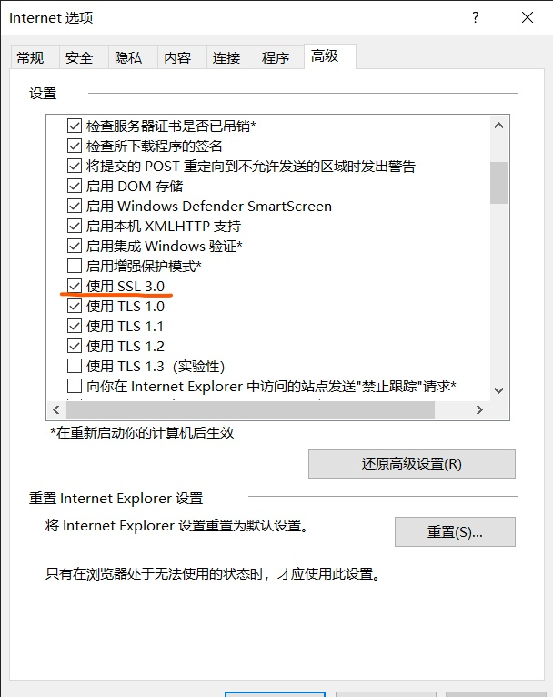
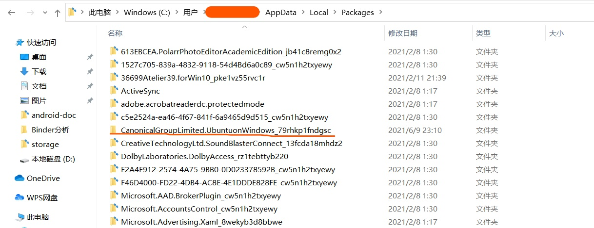
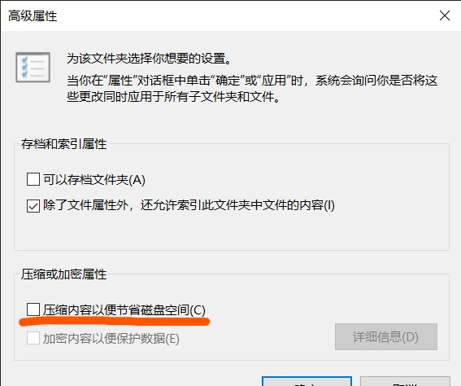
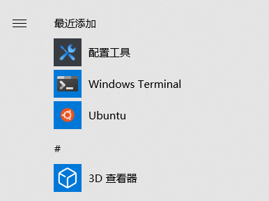
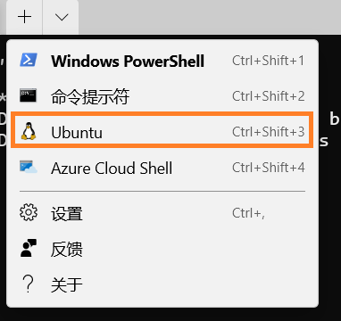
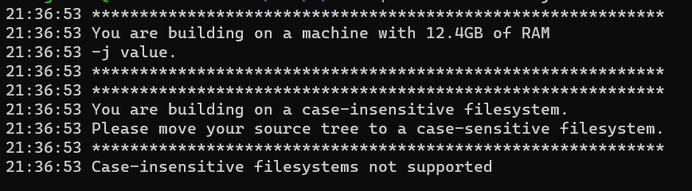

# Windows环境下编译Android

windows10提供了Windows Subsystem for Linux的环境系统，可以直接在windows下安装linux并运行，而且该环境能够区别于普通的虚拟机，能够更高效的运行。

## 在Window下开启WSL系统

按照

https://docs.microsoft.com/en-us/windows/wsl/install-win10

指示一步一步安装。需要加入windows的开发者预览计划。也很简单，直接注册即可。我按照手动安装的方式安装成功。

连接微软的应用市场的时候可能会报错，需要在浏览器选项中，开启SSL3.0：



安装ubuntu的时候：


执行到这一步时，并没有很顺利的success，原因在于，安装linux安装包的时候，文件启用了压缩方式，C:\users\用户名\AppData\Local\Packages下找到以下文件：



右键选择文件属性-高级，将压缩内容以便 节省磁盘空间即可。



安装完成后，即可在开始菜单中看到unbutu的启动菜单



点击菜单即可在linux下进入ubuntu系统


## 安装Window Terminals

Window Terminals不是必选安装的，但是window Terminals界面操作可能比较方便，安装后，可以在Windows Terminal下快速进入ubuntu系统终端：



## 下载AOSP代码

安装必要的软件后，国内通过中科大镜像或者清华镜像下载，进行代码下载。一定要将AOSP的根目录设置为支持大小写，再进行代码下载同步，否则后面可能出现编译是无法找到类定义等错误。方法：以管理员身份启动powershell，执行以下命令（代码根目录设置为e盘下的AOSP目录）：

```shell
fsutil file setCaseSensitiveInfo /mnt/e/AOSP enable
```


## AOSP编译

需要安装必要的软件：

```shell
sudo apt-get install git-core gnupg flex bison build-essential zip curl zlib1g-dev gcc-multilib g++-multilib libc6-dev-i386 lib32ncurses5-dev x11proto-core-dev libx11-dev lib32z1-dev libgl1-mesa-dev libxml2-utils xsltproc unzip fontconfig
```

注意不要更换apt源，目前国内的源还是老版本的ubuntu源，20.04的ubuntu跟换源后，可能存在软件无法安装的问题。直接使用自带的源即可。

跟android官网上的描述操作一样，进入代码根目录：

- source build/envsetup.sh。初始化编译环境
- lunch选择目标类型。一般可以直接lunch aosp_arm-eng或lunch aosp_arm64-eng
- make


### 文件系统大小写错误

执行到make的时候可能会遇到如下错误：



原因是windows下的文件系统是大小写不敏感的，而AOSP编译要求文件系统是大小写敏感系统，要求把源码树移动到大小写敏感的文件系统下。
