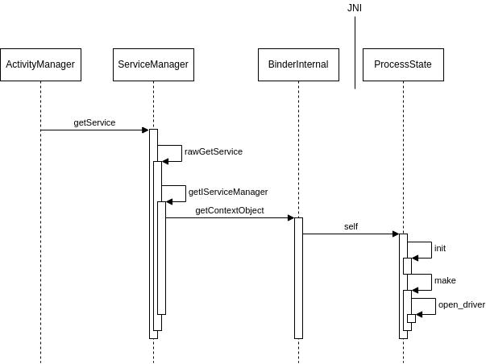

# 我的binder学习总结

## binder驱动中的数据结构

### binder_proc

binder_proc在binder驱动中代表一个进程，每个进程在open binder驱动的时候，在binder驱动中会创建出一个binder_proc来标识该进程

```c
static int binder_open(struct inode *nodp, struct file *filp)
{
	struct binder_proc *proc, *itr;
	struct binder_device *binder_dev;
	struct binderfs_info *info;
	struct dentry *binder_binderfs_dir_entry_proc = NULL;
	bool existing_pid = false;

	binder_debug(BINDER_DEBUG_OPEN_CLOSE, "%s: %d:%d\n", __func__,
		     current->group_leader->pid, current->pid);

	proc = kzalloc(sizeof(*proc), GFP_KERNEL);
	...
    proc->pid = current->group_leader->pid;
	INIT_LIST_HEAD(&proc->delivered_death);
	INIT_LIST_HEAD(&proc->waiting_threads);
	filp->private_data = proc;
    ...
}
```

binder驱动打开后，在对应的binder_proc数据结构中将保留对应的应用的信息，包括对应的进程的pid等信息。binder_proc的数据结构将保存在file对象的private_data中，后续通过文件操作接口来操作binder驱动的file对象中，都可以通过该字段获取binder_proc信息


binder驱动中全局的binder_procs列表中，保存了所有打开binder驱动的应用的信息，即binder_proc，通过该列表可以遍历所有的打开binder驱动的进程


### binder_thread

当应用对binder驱动的文件进行ioctl的时候，在binder驱动中，首先需要明确binder_thread，然后才能进行下一步操作，以binder调用请求为例：

```c
static long binder_ioctl(struct file *filp, unsigned int cmd, unsigned long arg)
{
	int ret;
	struct binder_proc *proc = filp->private_data;
	struct binder_thread *thread;
	unsigned int size = _IOC_SIZE(cmd);
	void __user *ubuf = (void __user *)arg;

	/*pr_info("binder_ioctl: %d:%d %x %lx\n",
			proc->pid, current->pid, cmd, arg);*/

	binder_selftest_alloc(&proc->alloc);

	trace_binder_ioctl(cmd, arg);

	ret = wait_event_interruptible(binder_user_error_wait, binder_stop_on_user_error < 2);
	if (ret)
		goto err_unlocked;

	thread = binder_get_thread(proc);
	if (thread == NULL) {
		ret = -ENOMEM;
		goto err;
	}

	switch (cmd) {
	case BINDER_WRITE_READ:
		ret = binder_ioctl_write_read(filp, cmd, arg, thread);
		if (ret)
			goto err;
		break;
		...
}
```

binder调用即是通过向binder驱动执行ioctl命令BINDER_WRITE_READ来完成，BINDER_WRITE_READ调用执行binder_ioctl_write_read函数来处理binder调用请求，但是在这之前会先通过binder_get_thread来获取binder_thread对象：

```c
static struct binder_thread *binder_get_thread(struct binder_proc *proc)
{
	struct binder_thread *thread;
	struct binder_thread *new_thread;

	binder_inner_proc_lock(proc);
	thread = binder_get_thread_ilocked(proc, NULL);
	binder_inner_proc_unlock(proc);
	if (!thread) {
		new_thread = kzalloc(sizeof(*thread), GFP_KERNEL);
		if (new_thread == NULL)
			return NULL;
		binder_inner_proc_lock(proc);
		thread = binder_get_thread_ilocked(proc, new_thread);
		binder_inner_proc_unlock(proc);
		if (thread != new_thread)
			kfree(new_thread);
	}
	return thread;
}
```

核心逻辑在binder_get_thread_ilocked中：

```c
static struct binder_thread *binder_get_thread_ilocked(
		struct binder_proc *proc, struct binder_thread *new_thread)
{
	struct binder_thread *thread = NULL;
	struct rb_node *parent = NULL;
	struct rb_node **p = &proc->threads.rb_node;

	while (*p) {
		parent = *p;
		thread = rb_entry(parent, struct binder_thread, rb_node);

		if (current->pid < thread->pid)
			p = &(*p)->rb_left;
		else if (current->pid > thread->pid)
			p = &(*p)->rb_right;
		else
			return thread;
	}
	if (!new_thread)
		return NULL;
	thread = new_thread;
	binder_stats_created(BINDER_STAT_THREAD);
	thread->proc = proc;
	thread->pid = current->pid;
	get_task_struct(current);
	thread->task = current;
	atomic_set(&thread->tmp_ref, 0);
	init_waitqueue_head(&thread->wait);
	INIT_LIST_HEAD(&thread->todo);
	rb_link_node(&thread->rb_node, parent, p);
	rb_insert_color(&thread->rb_node, &proc->threads);
	thread->looper_need_return = true;
	thread->return_error.work.type = BINDER_WORK_RETURN_ERROR;
	thread->return_error.cmd = BR_OK;
	thread->reply_error.work.type = BINDER_WORK_RETURN_ERROR;
	thread->reply_error.cmd = BR_OK;
	INIT_LIST_HEAD(&new_thread->waiting_thread_node);
	return thread;
}
```

对于发起调用binder驱动接口的线程，binder驱动中在当前线程所在的进程的threads列表中按照线程的pid查找是否存在binder_thread，如果有，则使用对应的binder_thread作为后续的一系列操作的参数，如果没有，那么将创建一个新的binder_thread出来，并加入到对应的binder_proc的threads列表中，所以在binder驱动中的进程和线程的关系类似如下图所示


综上，binder驱动中的一个binder_thread对象，表示应用进程中发起binder调用请求的线程（TBD：接受binder请求的线程是否有binder_thread表示呢？）

### binder_transaction


### binder_node

在每个binder_proc结构中，保存了一个refs_by_desc的红黑树，该红黑树的索引键值为binder的descriptor值，即binder的handle值，任何进程通过binder的handle值传入进来后，对该红黑树进行索引，既可以找到对应的binder_ref结构，而在binder_ref结构中保存的node指针，又可以找到对应的binder_node，同样在binder_proc中具有一个nodes的红黑树，也可以找到对应的binder_node节点，所不同的是notes红黑树使用的是用户空间的指针作为索引键：


任何binder调用的传输，需要先找到binder_node。

什么时候会创建transaction_node对象？


#### 本地binder创建的binder_node

transaction_node对应在上层用户空间中传递的一个binder对象，当上层把binder对象在parcel中进行序列化的时候，就会触发在kernel驱动中创建transaction_node的对象，Parcel中序列化binder对象：

```c++
status_t Parcel::flattenBinder(const sp<IBinder>& binder) {
    BBinder* local = nullptr;
    if (binder) local = binder->localBinder();
    if (local) local->setParceled();
    ...
    flat_binder_object obj;
    obj.flags = FLAT_BINDER_FLAG_ACCEPTS_FDS;
    ...
    if (binder != nullptr) {
        if (!local) {
            ...
            const int32_t handle = proxy ? proxy->getPrivateAccessor().binderHandle() : 0;
            obj.hdr.type = BINDER_TYPE_HANDLE;
            obj.binder = 0; /* Don't pass uninitialized stack data to a remote process */
            obj.handle = handle;
            obj.cookie = 0;
    	} else {
    	    ...
    	    obj.hdr.type = BINDER_TYPE_BINDER;
            obj.binder = reinterpret_cast<uintptr_t>(local->getWeakRefs());
            obj.cookie = reinterpret_cast<uintptr_t>(local);
    	}
     }
     ...
}
```

binder对象将序列化为一个扁平化对象flat_binder_object来传输，因为传输从放入本地的binder对象开始，如果放到parcel中的binder对象为本地的binder，那么放到flat_binder_object对象中的是一个BINDER_TYPE_BINDER类型的数据，binder指针（用户空间态）直接放到cookie字段，binder中存放的是binder的weak引用值。

kernel驱动中接收到此部分数据后：

```c
		...
        hdr = &object.hdr;
		off_min = object_offset + object_size;
		switch (hdr->type) {
		case BINDER_TYPE_BINDER:
		case BINDER_TYPE_WEAK_BINDER: {
			struct flat_binder_object *fp;

			fp = to_flat_binder_object(hdr);
			ret = binder_translate_binder(fp, t, thread);

			if (ret < 0 ||
			    binder_alloc_copy_to_buffer(&target_proc->alloc,
							t->buffer,
							object_offset,
							fp, sizeof(*fp))) {
				return_error = BR_FAILED_REPLY;
				return_error_param = ret;
				return_error_line = __LINE__;
				goto err_translate_failed;
			}
		} break;
        ...
```

会将flat_binder_object的对象先还原出来，然后通过binder_translate_binder将fp对象中的binder翻译

```c
static int binder_translate_binder(struct flat_binder_object *fp,
				   struct binder_transaction *t,
				   struct binder_thread *thread)
{
	struct binder_node *node;
	struct binder_proc *proc = thread->proc;
	struct binder_proc *target_proc = t->to_proc;
	struct binder_ref_data rdata;
	int ret = 0;

	node = binder_get_node(proc, fp->binder);
	if (!node) {
		node = binder_new_node(proc, fp);
		if (!node)
			return -ENOMEM;
	}
    
	...
        
	ret = binder_inc_ref_for_node(target_proc, node,
			fp->hdr.type == BINDER_TYPE_BINDER,
			&thread->todo, &rdata);
	if (ret)
		goto done;

	if (fp->hdr.type == BINDER_TYPE_BINDER)
		fp->hdr.type = BINDER_TYPE_HANDLE;
	else
		fp->hdr.type = BINDER_TYPE_WEAK_HANDLE;
	fp->binder = 0;
	fp->handle = rdata.desc;
	fp->cookie = 0;
	...
done:
	binder_put_node(node);
	return ret;
}
```

binder_translate_binder主要做以下操作：

1. 通过binder_thread（kernel里面可以通过current）找到发起binder通信的binder_proc对象
2. 把flat_binder_object中的binder取出来，即上层用户空间中保存的binder的weakref对象
3. 在binder_proc对象中根据binder的指针，通过**binder_get_node**找到对应的binder_node。如果是首次将binder对象放到驱动里面传送，那么此时将无法找到对应的binder_node
4. binder_inc_ref_for_node把对应的node的引用计数进行增加，该调用将会同时在返回的binder_ref_data中附带生成的binder的handle值
5. 直接将原始的flat_binder_object中的数据进行篡改，如果上层是

binder_inc_ref_for_node的过程如下：

```C
static int binder_inc_ref_for_node(struct binder_proc *proc,
			struct binder_node *node,
			bool strong,
			struct list_head *target_list,
			struct binder_ref_data *rdata)
{
	struct binder_ref *ref;
	struct binder_ref *new_ref = NULL;
	int ret = 0;

	binder_proc_lock(proc);
	ref = binder_get_ref_for_node_olocked(proc, node, NULL);
	if (!ref) {
		binder_proc_unlock(proc);
		new_ref = kzalloc(sizeof(*ref), GFP_KERNEL);
		if (!new_ref)
			return -ENOMEM;
		binder_proc_lock(proc);
		ref = binder_get_ref_for_node_olocked(proc, node, new_ref);
	}
	ret = binder_inc_ref_olocked(ref, strong, target_list);
	*rdata = ref->data;
	binder_proc_unlock(proc);
	if (new_ref && ref != new_ref)
		/*
		 * Another thread created the ref first so
		 * free the one we allocated
		 */
		kfree(new_ref);
	return ret;
}

static struct binder_ref *binder_get_ref_for_node_olocked(
					struct binder_proc *proc,
					struct binder_node *node,
					struct binder_ref *new_ref)
{
	struct binder_context *context = proc->context;
	struct rb_node **p = &proc->refs_by_node.rb_node;
	struct rb_node *parent = NULL;
	struct binder_ref *ref;
	struct rb_node *n;

	while (*p) {
		parent = *p;
		ref = rb_entry(parent, struct binder_ref, rb_node_node);

		if (node < ref->node)
			p = &(*p)->rb_left;
		else if (node > ref->node)
			p = &(*p)->rb_right;
		else
			return ref;
	}
	if (!new_ref)
		return NULL;

	binder_stats_created(BINDER_STAT_REF);
	new_ref->data.debug_id = atomic_inc_return(&binder_last_id);
	new_ref->proc = proc;
	new_ref->node = node;
	rb_link_node(&new_ref->rb_node_node, parent, p);
	rb_insert_color(&new_ref->rb_node_node, &proc->refs_by_node);

	new_ref->data.desc = (node == context->binder_context_mgr_node) ? 0 : 1;
	for (n = rb_first(&proc->refs_by_desc); n != NULL; n = rb_next(n)) {
		ref = rb_entry(n, struct binder_ref, rb_node_desc);
		if (ref->data.desc > new_ref->data.desc)
			break;
		new_ref->data.desc = ref->data.desc + 1;
	}

	p = &proc->refs_by_desc.rb_node;
	while (*p) {
		parent = *p;
		ref = rb_entry(parent, struct binder_ref, rb_node_desc);

		if (new_ref->data.desc < ref->data.desc)
			p = &(*p)->rb_left;
		else if (new_ref->data.desc > ref->data.desc)
			p = &(*p)->rb_right;
		else
			BUG();
	}
	rb_link_node(&new_ref->rb_node_desc, parent, p);
	rb_insert_color(&new_ref->rb_node_desc, &proc->refs_by_desc);

	binder_node_lock(node);
	hlist_add_head(&new_ref->node_entry, &node->refs);
	...
	binder_node_unlock(node);
	return new_ref;
}
```

经过两次的binder_get_ref_for_node_olocked调用，第一次调用由于传入的是NULL，将会创建一个新的binder_node，然后再一次调用，进行desc（其实就是handle句柄）的分配，分配句柄其实就是:

1. 待分配的句柄初始化为1
2. 在binder_proc的refs_by_desc红黑树中进行遍历，看当前红黑树中当前遍历节点的handle值是不是比当前待分配的句柄大
3. 如果当前节点的handle比待分配的句柄值大，则当前待分配的句柄值可以使用。
4. 否则就是当前节点的handle值与待分配的句柄值相等。将待分配的句柄值设置为当前遍历到的节点的handle值+1后在继续遍历
5. 直到找到一个空闲的handle值分配，或者是作为最后一个节点分配最大的handle值。

以上算法是合理的，因为红黑树遍历实际上就是从小到大遍历，从1开始遍历，逐步递增，如果值与当前遍历节点的关系只有小于或者等于两种情况。等于即表明该节点被占用，小于则说明有空闲的handle，可以分配使用。

所以综上，如果进程将binder序列化在parcel中传递，那么就会在kernel中有一个binder_node指代对应的binder对象。也就是说每个binder_node就是一个用户空间中的binder对象。


那么如果应用进程中将一个binder序列化到Parcel中后两次跨进程传输，是否会在binder驱动中创建出两个binder_node对象出来？答案是不会，在前面提到的代码中：

```c
static int binder_translate_binder(struct flat_binder_object *fp,
				   struct binder_transaction *t,
				   struct binder_thread *thread)
{
	struct binder_node *node;
	struct binder_proc *proc = thread->proc;
	struct binder_proc *target_proc = t->to_proc;
	struct binder_ref_data rdata;
	int ret = 0;

	node = binder_get_node(proc, fp->binder);
	if (!node) {
		node = binder_new_node(proc, fp);
		if (!node)
			return -ENOMEM;
	}
    
	...
        
	ret = binder_inc_ref_for_node(target_proc, node,
			fp->hdr.type == BINDER_TYPE_BINDER,
			&thread->todo, &rdata);
```

通过binder_get_node来到对应的binder_proc的红黑树中使用binder的指针去查询时，可以查询到对应的binder_node信息，从而不会再次调用binder_new_node来创建新的binder_node对象，也就是说只要涉及到跨进程通信的binder对象，在kernel中每个binder_proc代表唯一一个binder对象。虽然不会创建新的binder_node对象，但是会通过binder_inc_ref_for_node来将对应的binder_node的引用计数进行增加。


#### 远程binder创建的binder_node


### binder_ref 
binder_ref数据结构如下：


### binder_transaction

binder调用时，通过binder_transaction来记录涉及IPC通信的线程之间的传输，binder_transaction表示一个传输的事务，


from指向transaction发起方，to指向transaction接收方。传输数据的关系如下所示：


当应用进程发起binder调用传输请求时（发起调用或者reply调用），会对应在kernel空间有一个对应的binder_thread对象，而binder_thread中会保存一个transaction_stack的栈结构，用于保存关于binder请求的数据，包括：


### binder线程是如何创建的

每个进程涉及到IPC通信时，binder框架会为每个进程创建一系列的线程组，默认可以创建16个线程，可以通过ioctl命令设置最大的线程数量。任何应用运行过程中都会涉及到系统API的调用，而Android是CS的架构，因此API调用过程中必然会涉及到IPC通信，所以每个应用在首次调用API的时候会打开binder驱动，从而触发底层kernel中的数据结构的创建。
IPC调用都是以ServiceManager的接口查询开始，以ActivityManager为例：



当需要调用ActivityManager的接口时，由于AMS的接口实现在AMS中，需要进行跨进程通信，因此框架中的ActivityManager需要通过IPC binder机制与AMS通信，ActivityManager首先通过ServiceManager的getService方法获取serviceManager的服务管理类，然后再从ServiceManager中查询到AMS的binder对象返回。
当首次调用getService时，底层会创建出ProcessState的单例对象，在单例对象的构造函数中打开binder驱动。

#### ServiceManager的Binder线程池

ServiceManager是系统中的一个二进制可执行程序，其启动时，将执行对应二进制的main函数：

```c
int main(int argc, char** argv) {
	...

    const char* driver = argc == 2 ? argv[1] : "/dev/binder";

    sp<ProcessState> ps = ProcessState::initWithDriver(driver);
    ps->setThreadPoolMaxThreadCount(0);
    ps->setCallRestriction(ProcessState::CallRestriction::FATAL_IF_NOT_ONEWAY);

    sp<ServiceManager> manager = sp<ServiceManager>::make(std::make_unique<Access>());
    if (!manager->addService("manager", manager, false /*allowIsolated*/, IServiceManager::DUMP_FLAG_PRIORITY_DEFAULT).isOk()) {
        LOG(ERROR) << "Could not self register servicemanager";
    }

    IPCThreadState::self()->setTheContextObject(manager);
    ps->becomeContextManager();

    sp<Looper> looper = Looper::prepare(false /*allowNonCallbacks*/);

    BinderCallback::setupTo(looper);
    ClientCallbackCallback::setupTo(looper, manager);

    while(true) {
        looper->pollAll(-1);
    }

    // should not be reached
    return EXIT_FAILURE;
}
```
主要逻辑解读如下：
1. ProcessState::initWithDriver打开Binder驱动，此操作将会导致在kernel中为serviceanager这个进程创建binder_proc的对象
2. 将ServiceManager这个对象作为一个Binder服务调用addService加入到列表中
3. 调用setTheContextObject把ServiceManager对象设置到binder驱动中，此操作将会导致在底层binder驱动中生成一个对应于ServiceManager的Binder_node对象。
4. 调用BinderCallback::setupTo把serviceManager这个进程的binder驱动的文件句柄加入到lopper的epoll轮训句柄中，所以对于servicemanager这个进程在binder驱动中，其将会处罚poll相关文件操作
  ```c
      static sp<BinderCallback> setupTo(const sp<Looper>& looper) {
        sp<BinderCallback> cb = sp<BinderCallback>::make();

        int binder_fd = -1;
        IPCThreadState::self()->setupPolling(&binder_fd);
        LOG_ALWAYS_FATAL_IF(binder_fd < 0, "Failed to setupPolling: %d", binder_fd);

        int ret = looper->addFd(binder_fd,
                                Looper::POLL_CALLBACK,
                                Looper::EVENT_INPUT,
                                cb,
                                nullptr /*data*/);
        LOG_ALWAYS_FATAL_IF(ret != 1, "Failed to add binder FD to Looper");

        return cb;
    }
  ```
5. 设置时间处理的回调函数，轮训等待事件并处理

从以上代码中可以看出，在ServiceManager启动时没有主动的启动线程池。那么ServiceManager的线程池是如何创建起来的？
